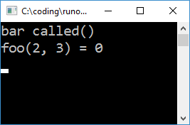

# Disclaimer
The code described in this note doesn't really aim to be pragmatic. Treat it as a curiosity rather than a recommendation. In fact, you probably don't want to use any of this nonsense in production environments (or even in most experimental environments).

# Introduction
Back in a previous life when I was a D programmer, I contributed to a project called [*D Dynamic Libraries*](http://www.dsource.org/projects/ddl). It was a pretty crazy system which on Windows provided means of loading plugins without the need for DLLs. *DDL* would load compiler-generated object files directly, and link them at runtime. For the D language it was a pretty major deal, as DLLs were severely broken at the time.

When I recently overhead [@gwihlidal](https://twitter.com/gwihlidal) and [@repi](https://twitter.com/repi) discuss their annoyances with DLLs, I figured "hold my beer", and went on to re-implement an ad-hoc version of *D Dynamic Libraries* in C++.

What are the annoyances? Here's a couple:
1. Duplication of symbols
2. Windows locking the DLL files while they're loaded

Item #1 can be a problem with anything using globals or singletons, such as RTTI systems, allocators, or logging systems. It also means potentially longer link times and plugins larger than they should be. This stems from globals being fully defined in both the host and plugins, rather than provided by just one (the host). I used to think this was a hard limitation of DLLs, in that they could not pull symbols from the host, but I was mistaken. One can use dllexport in the host, dllimport in the plugin, create an implib for the host, and provide it when linking the DLL. [Here's one example I found](https://github.com/mesonbuild/meson/issues/1623). When I tried it, the dllexport wasn't even needed for functions, only for variables. If you don't have full control over all code, it might be tricky to add dllimport to all the globals.

One might actually argue that #1 is a Good Thing as it enforces strict separation between the host and plugins, and results in cleaner architectures. But I'm not here to argue that (see disclaimer).

{:.center}
{:width="75%"}

Item #2 is just annoying, and mostly pops up when rolling a code hot-swap system. It can be easily worked around, but if we reinvent the wheel, we don't need to work around it :P

# Running code from OBJ

Suppose we have a *test.cpp* file with a simple function like this:

```cpp
int foo(int a, int b) {
	return a + b;
}
```

When we compile it, the resulting object file will contain the final executable code. We can actually just *fread()* it, find the location of the machine code, and call it. In order to appease Windows, we need to mark the memory executable with *VirtualProtect()*, but that's basically it:

```cpp
int main()
{
	CoffBinary coff;
	if (openCoff("test.obj", &coff)) {
		coff.parse();

		unsigned long prevProtect;
		VirtualProtect(
			coff.rawData, coff.rawDataSize,
			PAGE_EXECUTE_READWRITE, &prevProtect);

		auto foo = (int(*)(int, int))
			(coff.rawData + coff.sections[2].PointerToRawData);
		printf("foo(2, 3) = %d\n", foo(2, 3));
	}

	getchar();
	return 0;
}
```

{:.center}


Here I'm using a simple parser for the *Common Object File Format* (COFF) which I quickly cobbled together using [Microsoft's PE/COFF specification](http://www.microsoft.com/whdc/system/platform/firmware/PECOFF.mspx).

Things get more complicated when our function tries to reference other symbols, e.g.:

```cpp
#include <cstdio>
int foo(int a, int b) {
	puts("foo called()");
	return a + b;
}
```

{:.center}


We get a crash because the code is trying to perform a call to an unresolved function.

{:.center}


The generated "call" location is relative to the next instruction, and by default that offset is zero:

{:.center}


## Runtime linking

In order to run this code we need to *resolve* all unreferenced symbols. We do this by *linking* the binary to our application at runtime.

Linking this sample isn't particularly complicated because the object file contains most of the information we need.

Each section contains a list of relocations. Each relocation is a triple of:

* Offset into the section
* Index of the target symbol in the symbol table
* Type of relocation

In this case, the relocation type is a 32 bit offset relative to the next instruction. There are a few other relocation types, for example absolute 64 bit ones, but we only need to handle one type for this example.

```cpp
for (auto& rel : coff.getSectionRelocations(coff.sections[3])) {
	CoffBinary::Symbol& sym = coff.symbols[rel.SymbolTableIndex];
	char* relSource = nullptr;

	if (CoffBinary::SymClassStatic == sym.StorageClass) {
		// Reference to the static data segment in the OBJ
		relSource =
			coff.rawData +
			coff.sections[sym.SectionNumber - 1].PointerToRawData +
			sym.Value;
	} else if (CoffBinary::SymClassExternal == sym.StorageClass) {
		// External reference. Use DbgHelp to find symbol in host app
		SYMBOL_INFO symbol;
		symbol.SizeOfStruct = sizeof(SYMBOL_INFO);
		symbol.MaxNameLen = 1;
		std::string symName = coff.decodeString(sym.Name);
		if (SymFromName(GetCurrentProcess(), symName.c_str(), &symbol)) {
			relSource = (char*)symbol.Address;
		}
	}

	int* relTarget = (int*)(coff.rawData +
		coff.sections[3].PointerToRawData + rel.VirtualAddress);
	*relTarget = relSource - (char*)relTarget - 4;
}
```
Now when we run it, we get this:

{:.center}

