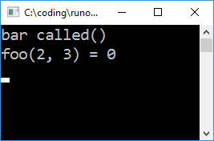
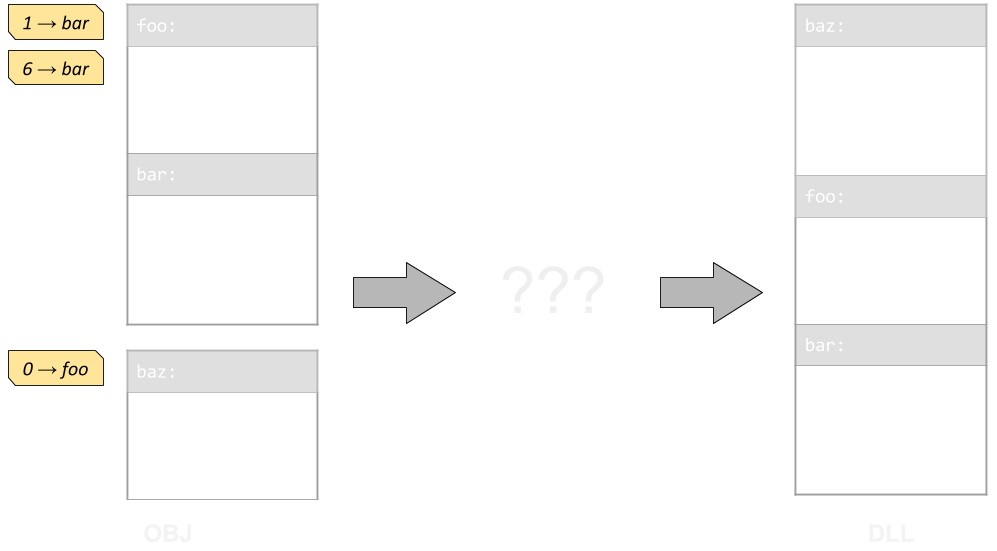
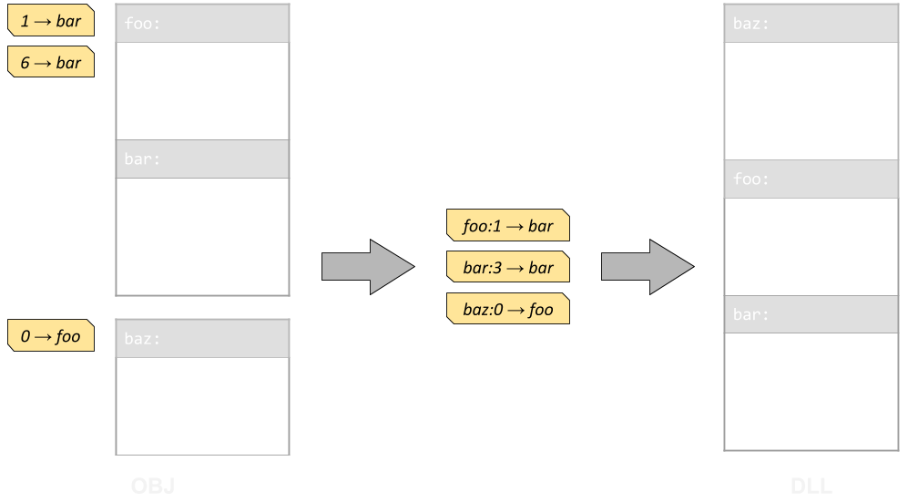
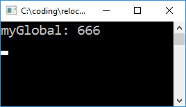

+++
title = "How not to use DLLs"
date = 2017-07-05

[extra]
banner_image = "runobj2.png"
+++

Runtime loading of object files, relocation of DLLs. Mostly harmful stuff.

<!-- more -->

# Disclaimer
The code described in this note doesn't really aim to be pragmatic. Treat it as a curiosity rather than a recommendation. In fact, you probably don't want to use any of this nonsense in production environments (or even in most experimental environments).

# Introduction
Back in a previous life when I was a D programmer, I contributed to a project called [*D Dynamic Libraries*](http://www.dsource.org/projects/ddl). It was a pretty crazy system which on Windows provided means of loading plugins without the need for DLLs. *DDL* would load compiler-generated object files directly, and link them at runtime. For the D language it was a pretty major deal, as DLLs were severely broken at the time.

When I recently overheard [@gwihlidal](https://twitter.com/gwihlidal) and [@repi](https://twitter.com/repi) discuss their annoyances with DLLs, I figured "hold my beer", and went on to re-implement an ad-hoc version of *D Dynamic Libraries* in C++.

What are the annoyances? Here's a couple:
1. Duplication of symbols
2. Windows locking the DLL files while they're loaded

Symbol duplication can cause problems with anything using globals; singletons will not be lonely either. They end up fully defined in both the host and plugins, rather than provided by just one (the host). This may impact RTTI systems, allocators, logging, etc. It also means potentially longer link times and plugins larger than they should be.

I used to think this was a hard limitation of DLLs, in that they could not pull symbols from the host. It turns out that I was mistaken; one can use *dllexport* in the host, *dllimport* in the plugin, create an *import library* for the host, and provide it when linking the DLL. [Here's one example I found](https://github.com/mesonbuild/meson/issues/1623). When I tried it, the *dllexport* wasn't actually *needed* for functions, but it was necessary for variables. If you don't have full control over all code, it might be tricky to add *dllimport* to all the globals.

One might actually argue that #1 is a Good Thing as it enforces strict separation between the host and plugins, and results in cleaner architectures. But I'm not here to argue that (see disclaimer).

</img>

Item #2 mostly pops up when rolling a code hot-swap system. It can be easily worked around, but if we reinvent the wheel, we don't need to work around it :P

# Running code from object files

Suppose we have a *plugin.cpp* file with a simple function like this:

```cpp
int foo(int a, int b) {
	return a + b;
}
```

When we compile it, the resulting object file will contain the final executable code. We can actually just *fread()* it, find the location of the machine code, and call it. In order to appease Windows, we need to mark the memory executable with *VirtualProtect()*, but that's basically it:

```cpp
int main()
{
	CoffBinary coff;
	if (openCoff("plugin.obj", &coff)) {
		coff.parse();

		unsigned long prevProtect;
		VirtualProtect(
			coff.rawData, coff.rawDataSize,
			PAGE_EXECUTE_READWRITE, &prevProtect);

		auto foo = (int(*)(int, int))
			(coff.rawData + coff.sections[2].PointerToRawData);
		printf("foo(2, 3) = %d\n", foo(2, 3));
	}

	getchar();
	return 0;
}
```


Here I'm using a simple parser for the *Common Object File Format* (COFF) which I quickly cobbled together using [Microsoft's PE/COFF specification](http://www.microsoft.com/whdc/system/platform/firmware/PECOFF.mspx).

Things get more complicated when our function tries to reference other symbols, e.g.:

```cpp
#include <cstdio>
int foo(int a, int b) {
	puts("foo called()");
	return a + b;
}
```


We get a crash because the code is trying to perform a call to an unresolved function.


The generated call address is relative to the next instruction, and by default that offset is zero:


## Runtime linking

In order to run this code we need to *resolve* all unreferenced symbols. We do this by *linking* the loaded binary image to our application at runtime.

An object file contains a number of sections, each potentially comprising data, executable code, debug symbols, and other stuff. Each section also contains a list of relocations. A relocation is a triple of:

* **Offset into the section** specifying a location where the relocation must be applied
* **Index of the symbol** that the location must be adjusted to point at
* **Type** of the relocation


In our simple case, the relocation type is a 32-bit offset relative to the next instruction. It means that the value we write when performing the relocation is not the address of the target symbol, but the offset to it from the address following the one we write. There are a few other relocation types, for example absolute 64-bit ones, but we only need to handle one type here.

```cpp
// Initialize DbgHelp so we can look-up symbols in the host.
SymInitialize(GetCurrentProcess(), nullptr, TRUE);

for (auto& rel : coff.getSectionRelocations(coff.sections[3])) {
	CoffBinary::Symbol& sym = coff.symbols[rel.SymbolTableIndex];
	char* relSource = nullptr;

	if (CoffBinary::SymClassStatic == sym.StorageClass) {
		// Reference to a static data segment in the OBJ
		relSource =
			coff.rawData +
			coff.sections[sym.SectionNumber - 1].PointerToRawData +
			sym.Value;
	} else if (CoffBinary::SymClassExternal == sym.StorageClass) {
		// External reference. Use DbgHelp to find symbol in host app
		SYMBOL_INFO symbol = {};
		symbol.SizeOfStruct = sizeof(SYMBOL_INFO);
		std::string symName = coff.decodeString(sym.Name);
		if (SymFromName(GetCurrentProcess(), symName.c_str(), &symbol)) {
			relSource = (char*)symbol.Address;
		}
	}

	// Address that needs patching up
	char* relTarget = coff.rawData +
		coff.sections[3].PointerToRawData + rel.VirtualAddress;

	// Write relative offset. Next instruction is 4 bytes after destination.
	*(int*)relTarget = relSource - relTarget - 4;
}
```
Now when we run our app, we get the following:



This is a basic version of runtime linking which completely bypasses DLL files. In [my github repository](https://github.com/h3r2tic/runobj) you can find a slightly more complete implementation which doesn't arbitrarily resolve only section three. It uses a different [COFF parser](https://github.com/serge1/COFFI) which I had borrowed from Serge Lamikhov-Center before I wrote my own. The sample also reads the host's MAP file to extract information about symbol locations, as even DbgHelp fails to find them all.

In practice one would also need to resolve multiple object files against each other, handle all relocation types, potentially create exception frames, and then some.

I didn't get that far though.


I got kinda stuck at trying to make Visual Studio's debugger load the debug info for the manually linked code. There are WinApi functions like [RtlAddFunctionTable](https://msdn.microsoft.com/en-us/library/windows/desktop/ms680588(v=vs.85).aspx) and [SymAddSymbol](https://msdn.microsoft.com/en-us/library/windows/desktop/ms680664(v=vs.85).aspx) which in theory can be used to feed extra symbols and debug info to DbgHelp and the CRT. It seems however that debuggers don't use whatever information the executable provides via those APIs, and have their own view of the debugee's symbols.

If you know a trick to get debug symbols to work with manual code loading, and it doesn't involve writing a debug engine, I would be very curious to learn about it. In the meantime though...

# Going back to DLLs

At this stage I had a working COFF reader/writer, and I was ready to get nasty. I figured that in order to get debug info, I had to use DLLs after all. Surely if it's possible to manually link object files, something similar could be done to DLLs.

The idea is to create a "broken" DLL with unreferenced/invalid symbols, load it using standard WinApi functions, and *then* link it at runtime, thus fixing it. How do we create that "broken" DLL? Glad you asked.
* Modify whatever object files go into the DLL, marking unresolved symbols resolved. It's pretty simple really: if a symbol's section index is zero, set it to anything greater than zero. It's ugly but it works.
* ... just use a few flags for link.exe: **/noentry /nodefaultlib /force**


The latter is pretty amazing in a way. The linker will report a bunch of errors, but then still produce a DLL. We can load it just fine, but any code using the unreferenced symbols will have a bad time. Let's fix it next.

## Relocating a DLL at runtime

The good news is that the DLL is internally linked, meaning that references to its own symbols are properly resolved. We don't need to fix all the symbols ourselves. The bad news however is that there's no relocation table anymore, and the linker has reshuffled the contents of our object file, so we can't trivially use the relocation table from our source objects.



Relocations are provided as locations within sections that need to be pointed at specific symbols. Contents of sections are moved around by the linker, but not arbitrarily -- the linker will not reshuffle every instruction. If we identify how chunks of code correlate between the objects and the final DLL, we can relocate the DLL.

Given an address within a section, we can find the last symbol whose location is less than or equal the address. If we sort all symbols in a section by their location, this becomes a simple binary search. Using this translation, a relocation becomes:
* A symbol specifying a location *within* which we need to apply the relocation
* An offset into the symbol's location
* The symbol at which we need to point
* Type of relocation (rel32, addr64, etc.)

We can then use a linker-generated [map of the DLL](https://msdn.microsoft.com/en-us/library/k7xkk3e2.aspx) to look-up its symbols, and apply relocations.



What does all this madness get us? We got debug symbols back! On the other hand, since we're once again in DLL land, Windows will insist on locking the file... At least we have gotten rid of the symbol duplication, which was the main goal. For example, this works:

```cpp
// plugin.cpp
#include <cstdio>

extern int myGlobal;
extern "C" __declspec(dllexport) void foo()
{
	printf("myGlobal: %d\n", myGlobal);
}
```

```cpp
// host.cpp
int myGlobal = 666;

int main()
{
	SymbolMap hostMap = parseMapFile("host.map", (char*)GetModuleHandle(0));
	HMODULE dll = loadAndRelocatePlugin("plugin", hostMap);

	auto foo = (void(*)())GetProcAddress(dll, "foo");

	foo();
	return 0;
}
```



You can grab a basic implementation of manual DLL relocation in another [repository of mine](https://github.com/h3r2tic/relocdll). It still only uses just one OBJ file for the plugin, but the concept should scale to more complex cases. It's still far from tested, and I might be missing some important pieces of info which might invalidate this approach. Again, take it with a grain of salt.

# 32-bit relative addresses

There's one more important detail I haven't covered yet; it applies to both DLL and object loading. Even on 64-bit systems, compilers will generate [32-bit relative call](http://www.felixcloutier.com/x86/CALL.html) instructions. That is, the target address is a signed 32-bit integer specifying an offset from the instruction following the call.

This means that all code must sit within (realistically) a 2GB **virtual memory** range. A single application will easily satisfy that *(\*cough\* unless it links certain GUI middleware)*. When Windows loads a DLL however, it typically places it pretty far in virtual address space from the host. Compilers will generate 64-bit calls for function pointers, so calling the plugin's interface is fine, however the code within the plugin will be using lots of 32-bit offsets. Since we're linking the plugin to our host app, those 32-bit offsets are in trouble.

In the case of object files, we can use *VirtualAlloc* to allocate the memory for our plugin. That way we can specify the address, and make sure it will sit within a 32-bit offset from our host's code. There's no *LoadLibrary* parameter to specify the load address of a DLL though, so we need to get dirty.

Now, Microsoft will tell us that we should not mess with [Address Layout Space Randomization](https://blogs.msdn.microsoft.com/winsdk/2009/11/30/how-to-disable-address-space-layout-randomization-aslr/), but in practice we can pass [/FIXED](https://msdn.microsoft.com/en-us/library/w368ysh2.aspx) to the linker, specify a [preferred load address](https://msdn.microsoft.com/en-us/library/f7f5138s.aspx), and if that address is available, our DLL will end up there.

We can also modify the preferred load address of the DLL ourselves. It's just the *"ImageBase"* value in the [optional PE header](https://msdn.microsoft.com/en-us/library/windows/desktop/ms680339(v=vs.85).aspx). Putting it all together, we get:
1. Get the address of the host application via GetModuleHandle(nullptr).
2. Open the DLL as a regular file, modify the preferred load address, and close it.
3. LoadLibrary
4. ???
5. DLL magically appears at our desired location. PROFIT!

# Epilogue

I hope this was somewhat educational or at least mildly entertaining. I guess the main point I'm trying to get through is that linkers aren't magic, and you can move some of their work to runtime.

I still don't recommend using any of this in the real world, but perhaps there are some crazy cases in which it would be useful *(Just In Time compilers? dev-only code hot-swap?)*. Just please don't send ninjas my way when something explodes :D
