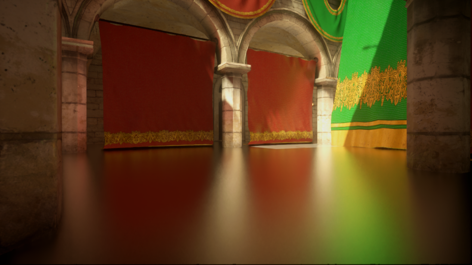

+++
title = "Stochastic Screen-Space Reflections"
date = 2015-08-10

[extra]
banner_vimeo = "115108688"
+++

Importance sampled screen-space reflections with a novel spatiotemporal filter. I prototyped it in a toy engine written in the Rust language, and later ported to Frostbite, working closely with Yasin Uludag. It first shipped in Mirror’s Edge and Need for Speed.

Check out the slides for my Siggraph 2015 talk which was part of [Advances in Real-Time Rendering in Games](http://advances.realtimerendering.com/s2015/).

<!-- more -->

Turns out it was a ratio estimator all along. Thanks for pointing that out, Ari Silvennoinen.

## Follow-ups

* [Raytracing in Hybrid Real-Time Rendering](/raytracing-in-hybrid-real-time-rendering/)
* [Combining ReSTIR and ratio estimation for ray-traced reflections](/restir-reflections/)